# Brokemon

A handheld-dex-style Android app where you "catch" your real-life friends ("bros") and collect them as pixel-art trading cards that evolve as the friendship grows. Local-first: everything stays on the phone.

Package: `com.joecode.brokemon` · Kotlin + Jetpack Compose · MVVM · Room · minSdk 26 · targetSdk 36 · compileSdk 37

| Brodex | Card | Room | Catch | Squads |
|---|---|---|---|---|
|  |  |  |  |  |

| Battle | Tournament | Accessories |
|---|---|---|
| 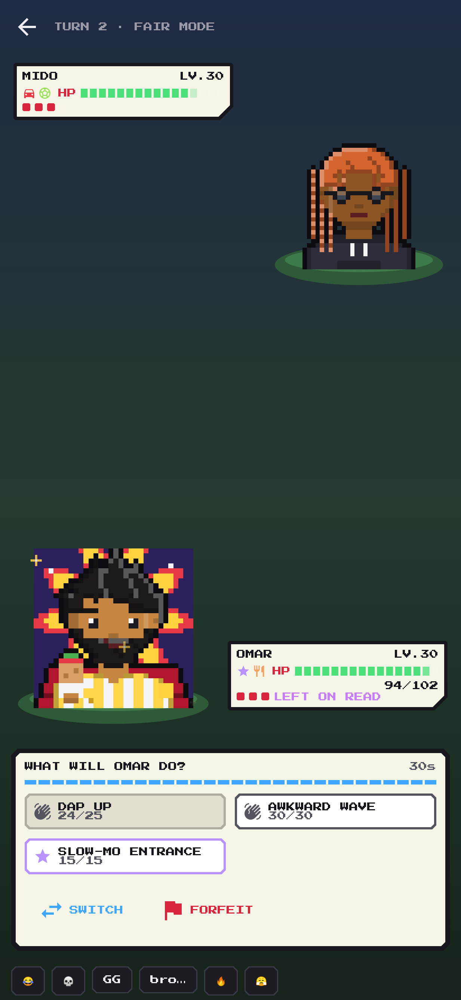 | 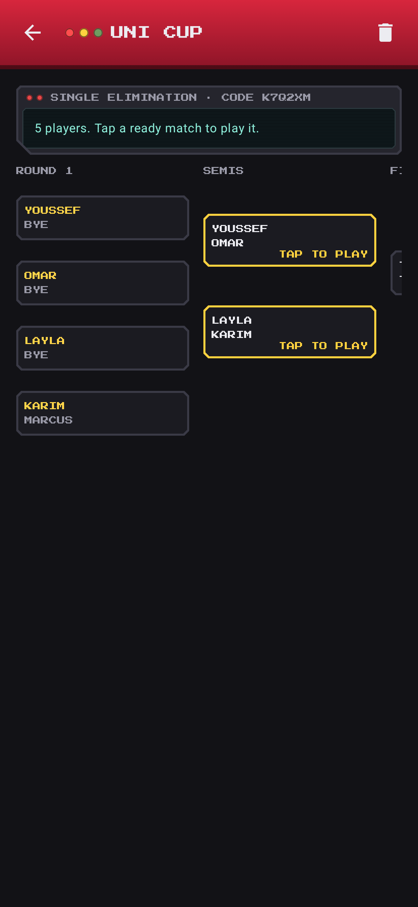 | 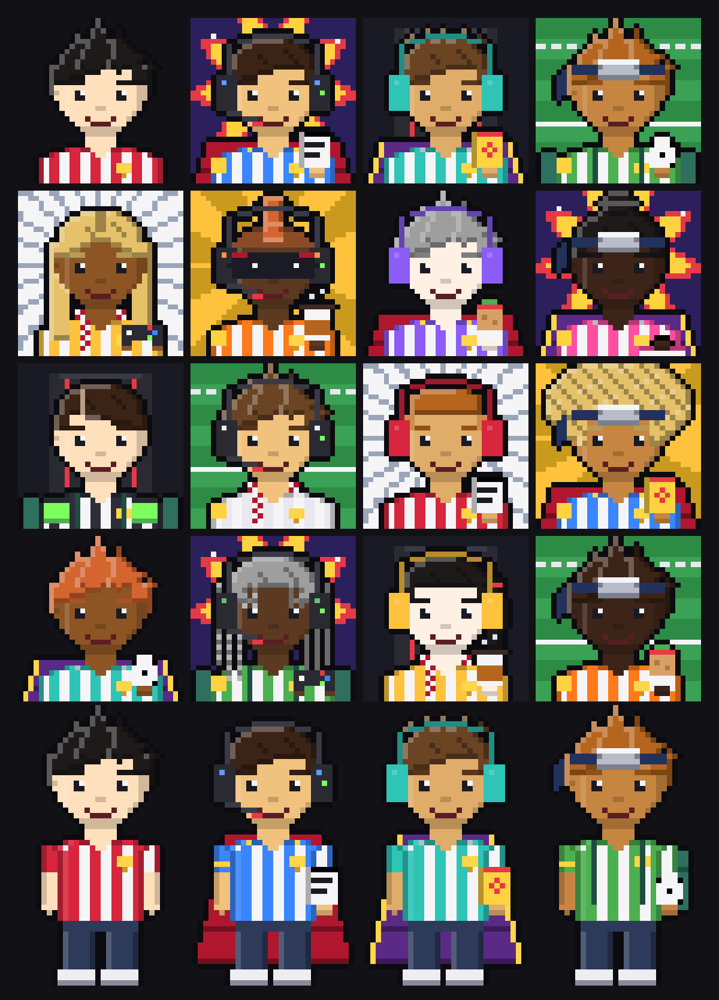 |

| Bro Prof intro | Empty dex | Pokédex list | Binder | Trainer Card | Journal | Wild bro | Stat hexagon |
|---|---|---|---|---|---|---|---|
| 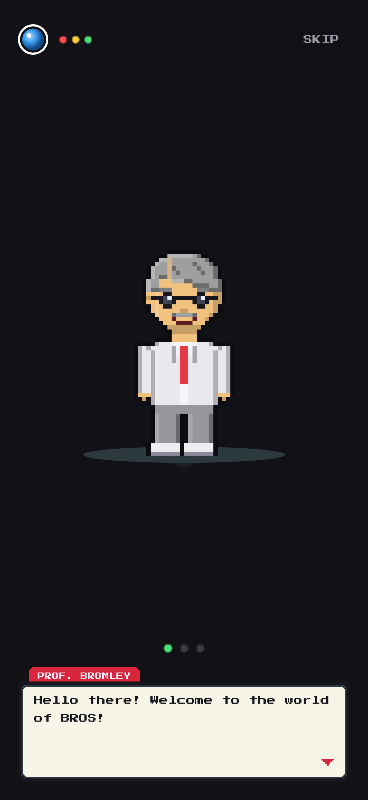 | 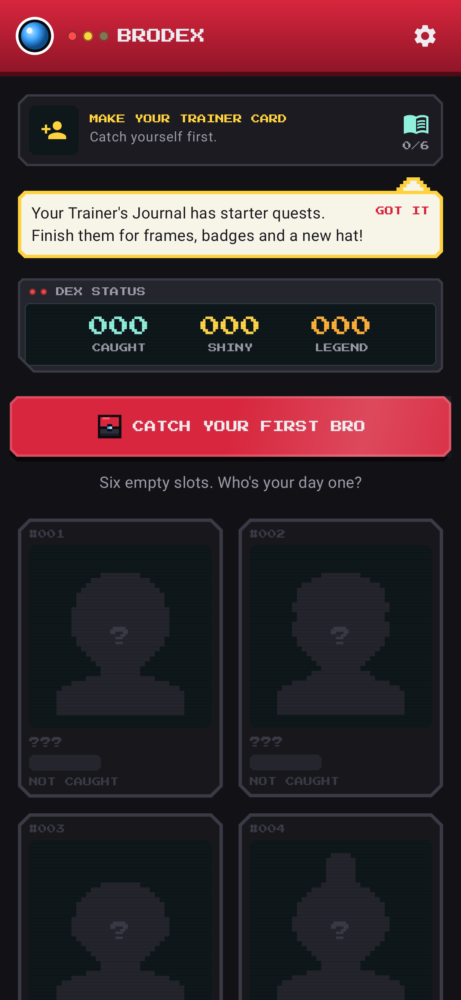 | 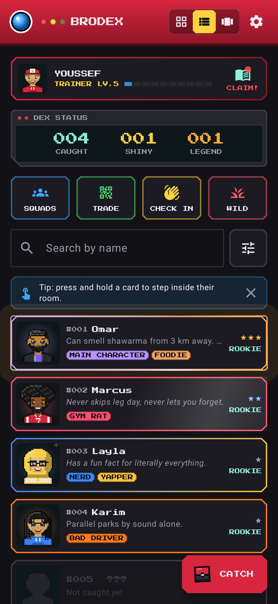 | 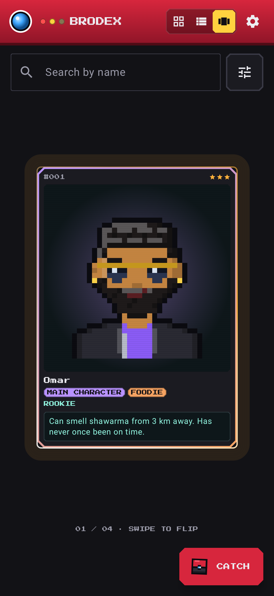 | 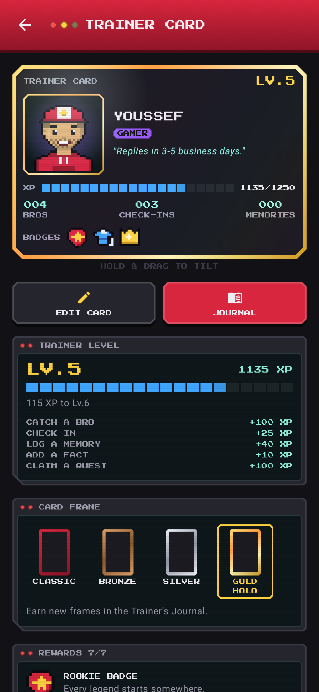 | 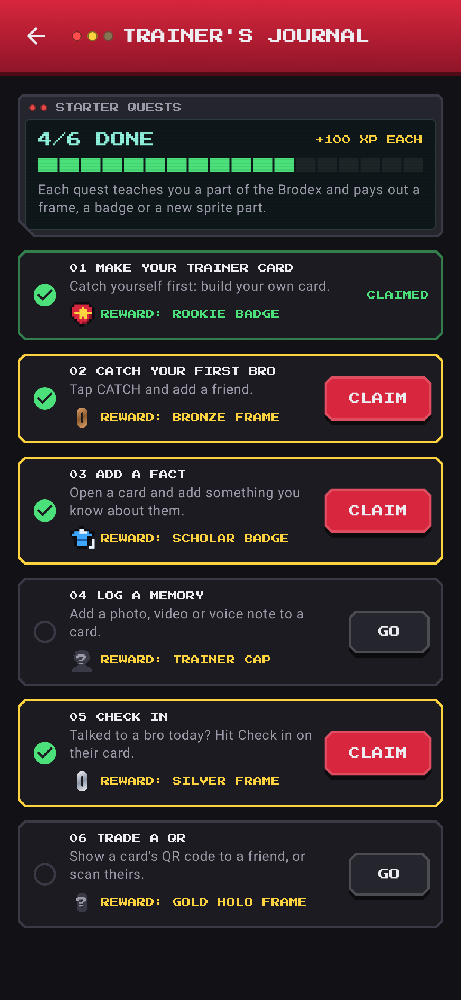 | 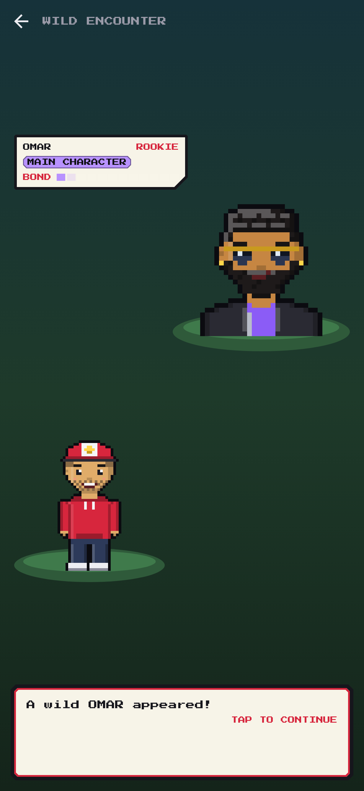 | 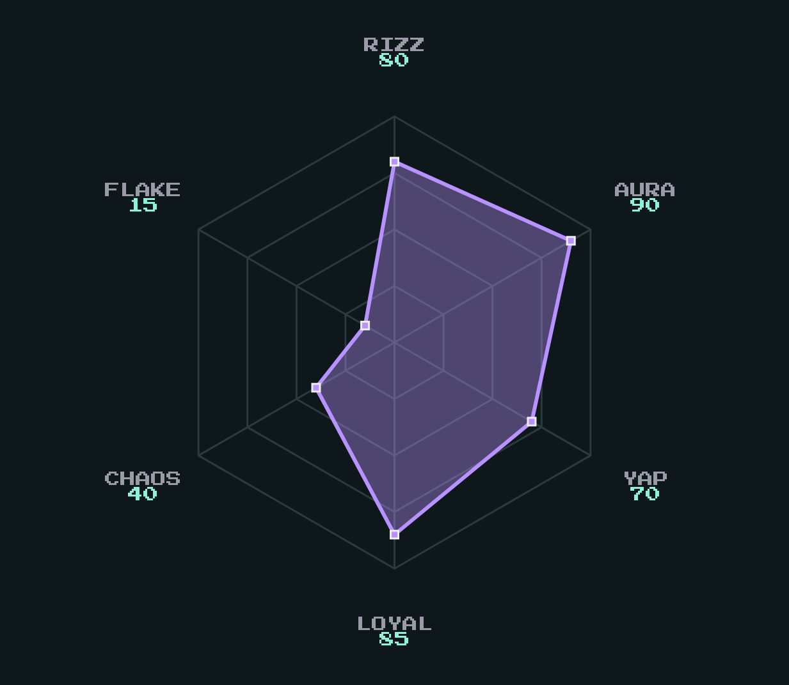 |

## What's new in 1.3.0

Bottom bar navigation, a 5-step catch wizard with Quick Catch and drafts, Dexy the guide, the Daily Pack (stickers, frames, backdrops, hats; cosmetics only, no streaks), idle sprite animation and type particles, illustrated rarity frames, Trainer Room, group photos, sound/haptics/reduce-motion settings, and a feedback email button. See [CHANGELOG.md](CHANGELOG.md).

## Features

- **Character builder**: bros are people. Build a 32×32 pixel portrait (plus a full-body sprite for their room) from 8 skin tones, 16 hairstyles (fade, waves, afro, braids, locs...), hair color, 6 faces, beards, 6 glasses, 7 hats (incl. bucket hat, backwards cap, hijab), 6 fits (incl. galabeya, leather jacket), fit color and extras (earring, freckles, scar...). Every option tile is a live preview. You can edit the look later from the card's menu.
- **Catch flow**: name, location, primary/secondary type (17 archetypes like Road Rager, Bad Driver, Yapper, Ghost, Main Character, Crypto Bro), manual rarity, funny stats (Rizz, Aura, Yap, Loyal, Chaos, Flake) with re-roll, preset + custom signature moves (max 4). A shiny roll (1 in 10) happens at catch. Catch animation: the Bro Cube drops, shakes three times, clicks, then a star burst and "GOTCHA!".
- **Brodex grid**: collectible cards with type-colored borders, rarity effects (Common: none, Rare: light sweep, Legendary: pulsing glow + gold rim), shiny sparkles, search and type filter.
- **Card detail**: idle-bobbing sprite, bond/evolution panel with score breakdown, animated stat bars, moves, memory log, facts, catch info, "met IRL" date, tradeable/locked toggle, rename / change rarity / release.
- **Memory log**: photo (`TakePicture`), video (`CaptureVideo`), or system photo picker. Files are copied into app-private storage. Thumbnails are EXIF-rotated; videos play in-app.
- **Evolution**: `score = memories×4 + check-ins×3 + facts×2 + min(monthsKnown, 24)`. The stage is always computed, never stored. Evolving also teaches a type-specific bonus move per stage (for example, a Road Rager learns Horn Solo, then Brake Check). When a bro crosses a threshold, the evolution animation plays: aura pulse, rising pixel flames, a white flicker that speeds up, a shift to gold, then a crossfade to the evolved sprite with a shockwave.
- **Squads**: up to 25 bros, a lighthearted type-matchup chart with scouting reasons, and a squad-vs-squad showdown.
- **QR trading**: compact `BRKM1:` payload with short keys. It carries only name, types, stats, moves, rarity, shiny and avatar seed. Photos, videos, facts and dates are never included. Scanning uses the Google Play services code scanner, so the app needs no CAMERA permission.
- **Check on a Bro**: weighted toward whoever you haven't checked on longest, never the same bro twice in a row, with conversation starters taken from their facts and type.
- **Brodex Wrapped**: a New Year event, only shown Dec 20 – Jan 15 (debug builds can force it by previewing the New Year event in Settings). A yearly recap pager with caught count, top types, first catch, rarest catches and memory MVP.
- **Hold the card (Pocket-style)**: on a bro's page the card is shown big. Press and drag to tilt it in 3D, with a foil glare that follows your finger (Rare/Legendary/shiny get rainbow foil). It springs back when you let go.
- **Bro rooms**: long-press any card on Home and it grows and zooms into that bro's room (shared-element transition). They stand or sit in a pixel room you decorate: wallpaper, floor, wall decor (game poster, manga shelf, neon sign, Ramadan lantern...), floor items (gaming desk, guitar, mini fridge...), a seat (couch, gaming chair, bean bag, floor cushion) and a rug. Tap them for a quip and their voice line. Hang out once a day, and their photos go up on the memory wall.
- **Search & filter**: the search box matches names. The filter sheet covers type, rarity, bond level, shiny, limited and tradeable, with 6 sort orders. Active filters show as removable chips.
- **Fair bond**: one check-in per bro per day (button, widget, notification and room), and only the first 10 facts count toward evolution.
- **Evolution styles**: power-up aura, lightning storm, glitchy "software update" or spotlight drumroll with confetti, depending on type.
- **Voice notes**: record voice memories (up to 60s) or import voice notes from the phone, plus a 10-second "voice line" per bro, like a signature cry. Tap their portrait to play it. Recorded in-app as .m4a and kept on-device.
- **Seasonal events**: limited frames during Ramadan, Eid (both from the Hijri calendar), New Year, Summer and Exam season, computed offline from the device date. Bros caught during an event keep its frame (lantern, crescent, fireworks, sun, pencil) forever, on the card, story image and QR trades. Debug builds can preview any event from Settings.
- **Backup & restore**: one-tap export of the whole Brodex (photos and videos included) to a .zip you keep anywhere, plus restore. Bros and settings also ride along in Android's end-to-end-encrypted backup and phone-to-phone transfer.
- **Share images**: "Post" renders a 1080×1920 story-sized card (and a Wrapped recap with an identity title like "Shiny Hunter") and opens the Android share sheet.
- **Bro of the Day widget**: a home-screen widget (Jetpack Glance) with today's bro, a nudge, one-tap check-in, and tap to open the card.
- **Reminders**: Birthday facts use a date picker. You get a birthday notification on the day and a Sunday-evening check-in nudge with a "Checked in" button. Everything is scheduled on-device with WorkManager and can be toggled in Settings.
- **Bro Prof intro**: on first launch, Professor Bromley (an original pixel character) welcomes you in three skippable dialogue screens with a typewriter text box. After that come the privacy promise and making your own Trainer Card. It shows once.
- **Trainer Card**: your own card ("catch yourself first"): pixel character, name, your type, a motto, your level and XP bar, totals, badges, and a frame (Classic, Bronze, Silver, Gold holo). You can hold and drag it to tilt it. It's stored in DataStore, never counts as a catch, and rides along in backups.
- **Trainer level**: XP from making your card (50), catches (100), check-ins (25), memories (40), facts (10) and claimed quests (100). Level N needs 50·(N−1)² XP.
- **Trainer's Journal**: six starter quests (make your Trainer Card → catch your first bro → add a fact → log a memory → check in → trade a QR). Each one has a GO shortcut, a progress bar and a CLAIM button that pays out a reward with a "Reward get!" popup: badges (Rookie, Scholar, Bro Master for finishing), card frames, and the Trainer cap sprite part, which shows locked in every character builder until you earn it.
- **Never-empty Brodex**: uncaught slots #001–#006 show as dark "???" silhouettes, with a pulsing "Catch your first Bro" button on a fresh install.
- **Coach marks**: one-time pixel speech bubbles point at features the first time you meet them, like "Talked to Omar today? Tap here!" on a card's Check in. Home shows one bubble at a time. The seen set lives in DataStore.
- **Three dex views**: a switch in the top bar flips between the card grid, a Pokédex list (sprite, number + name, dex entry, types, rarity, with the same type colors and rarity glow) and a Binder (one big card at a time, swipe to flip). The switch animates, your choice is remembered, and the search bar and filter chips sit above every view.
- **Dex entries**: one funny line per bro ("Can smell shawarma from 3 km away"), set at catch or from the card menu. It shows on the big card, in the binder and as the subtitle in the list, and travels in QR trades. Bros without one fall back to their type's blurb.
- **A wild bro appeared!**: shake the phone on Home (accelerometer, only while the screen is open) or tap WILD. A random bro, leaning toward whoever you've neglected, jumps out with a retro battle intro: flashes, closing bars, slide-in and a text box. Then you can message them on WhatsApp (falls back to the share sheet), check in, roll another, or run.
- **Stat hexagon**: a Canvas radar chart of the six stats that grows in from the middle, with a HEX/BARS toggle.
- **Real foil holo**: the card foil is three layers driven by finger tilt + the phone's gyro (low-pass filtered, ±25°, only while a card is on screen): a rainbow band that sweeps along the diagonal, a specular glare moving opposite to the tilt (only when tilted), and a foil texture (hairlines + sparkle grain). Masked to the art and the border so text stays readable. AGSL `RuntimeShader` on Android 13+, gradient + texture fallback below. Levels: Common none, Rare band, Epic band + glare, Legendary everything + sparkles, Shiny gold/silver.
- **Epic rarity** between Rare and Legendary.
- **App shortcuts**: long-press the icon for Catch a Bro, Scan QR and Random Bro (pixel shortcut icons).
- **Earned shinies**: no more shiny roll at catch. Each logged memory has a 1/20 chance (`ShinyHunt.ODDS`) to turn the bro shiny, at most one roll per bro per day, with a full-screen "SHINY!" card-flip moment and a share button.
- **Habitat**: "Uni cafeteria", "Discord"... a text field with quick-pick chips, shown on the big card and in Catch info.
- **Regional dexes**: make "Uni Dex", "Gym Dex"... Each has its own numbering (#001...) and counter. Bros can be in several (many-to-many `BroDexCrossRef`). Switch dexes with chips on Home; cards, list and binder all follow. Manage membership from Home or a card's menu.
- **Accessories**: one per slot, all original: head (headset, headphones, ninja-style band), face (hero mask), new anime spikes hair, made-up football kits + captain armband, hand items (manga, comic, football, controller, coffee, shawarma, gym bag, keeper gloves), back (hero cape, cosplay cape, backpack, scarf) and backdrops (POW!, gaming chair, pitch, speed lines, trophy glow). Some are locked: Trainer cap (Journal), Hero cape (earn a shiny), POW! (finish the Journal), Trophy glow (win a tournament).
- **Bro Battles** (all free and offline, no server):
  - A pure-Kotlin, deterministic engine (`domain/battle`): state + two actions + seed → next state, so phones only exchange actions. Legality checks (illegal = forfeit), snapshot validation (stats and moves recomputed from the rules), 3v3 or 1v1, Fair Mode (everyone Lv.30), type matchups from `TypeMatchups`, five original status effects (Cringed, Left on Read, Hyped, Sleepy, Main Character) in one table.
  - Moves unlock with friendship (level = 5 + evolution score, max 50); 4 equipped per bro; custom signature moves use fixed power templates.
  - Modes: Practice vs CPU, same phone (pass and play), and Nearby (Google Nearby Connections over Bluetooth/Wi-Fi): host gets a 6-character code (no 0/O/1/I/L) + QR, codes expire after 10 minutes, 60-second reconnect window.
  - Battle screen: typewriter text with big pools of original lines, hit flash, screen shake and haptics, "goes AFK" faints, emotes, 30-second turn timer, recap image (9:16), rematch.
  - Tournaments (bracket with byes or round robin) built from a dex or squad, kept on the organizer's phone; play matches here or on Nearby, or record a result. Champions get a trophy on the Trainer Card and a gold champion frame on their MVP bro.
  - Local records: W/L, streaks, monthly season table, you-vs-each-friend leaderboard, MVP bro, and replays (seed + actions).
  - Daily battle quest (win with a given type, +60 XP), win XP, and a capped once-a-day bond bonus for the MVP.
  - Accessibility: type icons next to colors, battle text speed setting.
- **Privacy**: onboarding consent, in-app privacy policy, delete-all, no INTERNET permission.

## Build

Open the project in Android Studio (a current stable release that supports AGP 9.4), let Gradle sync, and run the `app` configuration.

```
./gradlew :app:testDebugUnitTest   # 72 unit tests (battle engine, tournaments, journal, QR, evolution, sprites...)
./gradlew :app:assembleDebug
./gradlew :app:bundleRelease       # Play Store .aab (R8 + resource shrinking)
```

Release signing reads `keystore.properties` at the repo root (git-ignored):

```
storeFile=brokemon-release.jks
storePassword=...
keyAlias=brokemon
keyPassword=...
```

## Project map

```
app/src/main/java/com/joecode/brokemon/
  data/model/      Bro, Memory, Fact, BroStats, BroType, Rarity, MediaType, Squad
  data/local/      Room: BroDao, SquadDao, BroDatabase, Gson Converters
  data/            BroRepository, MediaStorage (app-private files), UserPrefs (DataStore)
  domain/          Evolution, EvolutionMoves, TypeMatchups, CheckOnBro, Wrapped, Journal (quests, rewards, trainer level), HumanSprite — pure Kotlin, unit tested
  share/           QrCodec (compact payload), QrBitmap (ZXing)
  ui/theme/        Dark-only Pokédex palette, Press Start 2P + sans body text
  ui/components/   DexScaffold (red device header, LEDs), ScreenPanel (LCD), BroCard, BroSprite, effects
  ui/<feature>/    home, catchbro, detail, squads, trade, engage, settings, onboarding, share, room, trainer, wild
  data/backup/     BackupManager (zip export/restore)
  widget/          Bro of the Day Glance widget
  notify/          Reminder worker, notifications, check-in action receiver
```

See `docs/SCHEMA.md` for the database plan, `docs/LEARNING.md` for a guided walkthrough, and `docs/PLAY_STORE.md` for the release checklist.

## Assets and licensing

All character art (drawn pixel by pixel in code), the Bro Cube, the launcher icon and UI art are original or procedurally generated. The pixel font is Press Start 2P (SIL OFL 1.1, see `licenses/`). No Nintendo or Pokémon names, logos or assets are used.
