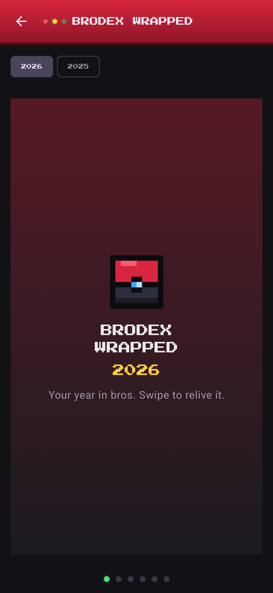

# Brokemon

A Pokédex-style Android app where you "catch" your real-life friends ("bros") and collect them as pixel-art trading cards that evolve as the friendship grows. Local-first: everything stays on the phone.

Package: `com.joecode.brokemon` · Kotlin + Jetpack Compose · MVVM · Room · minSdk 26 · targetSdk 36 · compileSdk 37

| Brodex | Catch | Card detail | Squads | Wrapped |
|---|---|---|---|---|
|  |  |  |  |  |

## Features

- **Character builder**: bros are people. Build a 32×32 pixel portrait by picking skin tone, hairstyle (10), hair color, face, beard, glasses, hat, fit and fit color. Every option tile is a live preview. You can edit the look later from the card's menu.
- **Catch flow**: name, location, primary/secondary type (17 archetypes like Road Rager, Bad Driver, Yapper, Ghost, Main Character, Crypto Bro), manual rarity, funny stats (Rizz, Aura, Yap, Loyal, Chaos, Flake) with re-roll, preset + custom signature moves (max 4). A shiny roll (1 in 10) happens at catch. Catch animation: the Bro Cube drops, shakes three times, clicks, then a star burst and "GOTCHA!".
- **Brodex grid**: collectible cards with type-colored borders, rarity effects (Common: none, Rare: light sweep, Legendary: pulsing glow + gold rim), shiny sparkles, search and type filter.
- **Card detail**: idle-bobbing sprite, bond/evolution panel with score breakdown, animated stat bars, moves, memory log, facts, catch info, "met IRL" date, tradeable/locked toggle, rename / change rarity / release.
- **Memory log**: photo (`TakePicture`), video (`CaptureVideo`), or system photo picker. Files are copied into app-private storage. Thumbnails are EXIF-rotated; videos play in-app.
- **Evolution**: `score = memories×4 + check-ins×3 + facts×2 + min(monthsKnown, 24)`. The stage is always computed, never stored. Evolving also teaches a type-specific bonus move per stage (for example, a Road Rager learns Horn Solo, then Brake Check). When a bro crosses a threshold, the evolution animation plays: aura pulse, rising pixel flames, a white flicker that speeds up, a shift to gold, then a crossfade to the evolved sprite with a shockwave.
- **Squads**: up to 25 bros, a lighthearted type-matchup chart with scouting reasons, and a squad-vs-squad showdown.
- **QR trading**: compact `BRKM1:` payload with short keys. It carries only name, types, stats, moves, rarity, shiny and avatar seed. Photos, videos, facts and dates are never included. Scanning uses the Google Play services code scanner, so the app needs no CAMERA permission.
- **Check on a Bro**: weighted toward whoever you haven't checked on longest, never the same bro twice in a row, with conversation starters taken from their facts and type.
- **Brodex Wrapped**: a New Year event, only shown Dec 20 – Jan 15 (debug builds always show it for testing). A yearly recap pager with caught count, top types, first catch, rarest catches and memory MVP.
- **Privacy**: onboarding consent, in-app privacy policy, delete-all, no INTERNET permission, backups disabled.

## Build

Open the project in Android Studio (a current stable release that supports AGP 9.4), let Gradle sync, and run the `app` configuration.

```
./gradlew :app:testDebugUnitTest   # 27 unit tests (evolution, QR codec, recommender, matchups, sprites, wrapped)
./gradlew :app:assembleDebug
./gradlew :app:bundleRelease       # Play Store .aab (R8 minified + resource shrinking)
```

Release signing reads `keystore.properties` at the repo root (git-ignored):

```
storeFile=brokemon-release.jks
storePassword=...
keyAlias=brokemon
keyPassword=...
```

## Project map

```
app/src/main/java/com/joecode/brokemon/
  data/model/      Bro, Memory, Fact, BroStats, BroType, Rarity, MediaType, Squad
  data/local/      Room: BroDao, SquadDao, BroDatabase, Gson Converters
  data/            BroRepository, MediaStorage (app-private files), UserPrefs (DataStore)
  domain/          Evolution, EvolutionMoves, TypeMatchups, CheckOnBro, Wrapped, HumanSprite — pure Kotlin, unit tested
  share/           QrCodec (compact payload), QrBitmap (ZXing)
  ui/theme/        Dark-only Pokédex palette, Press Start 2P + sans body text
  ui/components/   DexScaffold (red device header, LEDs), ScreenPanel (LCD), BroCard, BroSprite, effects
  ui/<feature>/    home, catchbro, detail, squads, trade, engage, settings, onboarding
```

See `docs/LEARNING.md` for a guided walkthrough, and `docs/PLAY_STORE.md` for the release checklist.

## Assets and licensing

All character art (drawn pixel by pixel in code), the Bro Cube, the launcher icon and UI art are original or procedurally generated. The pixel font is Press Start 2P (SIL OFL 1.1, see `licenses/`). No Nintendo or Pokémon names, logos or assets are used.
