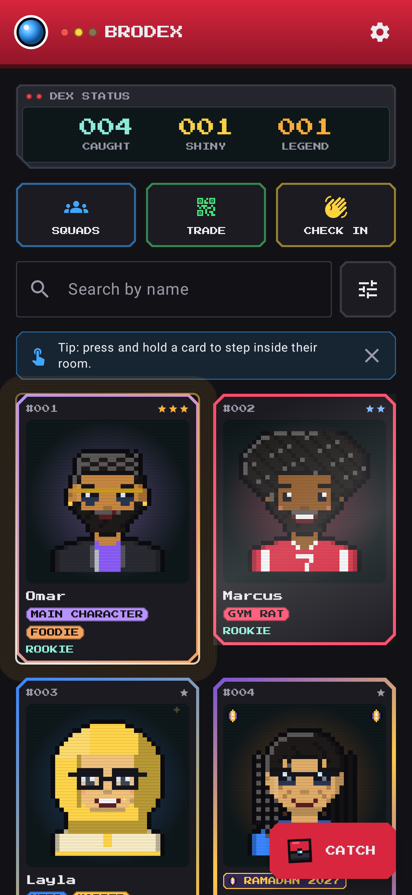
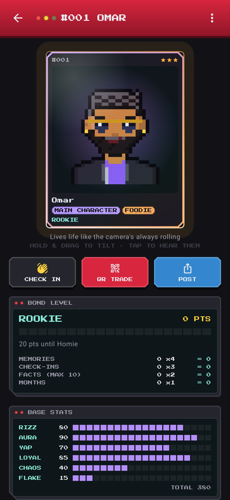
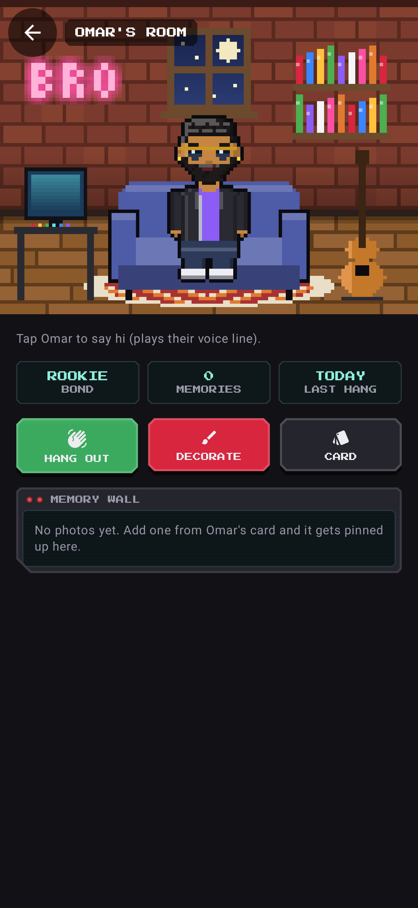
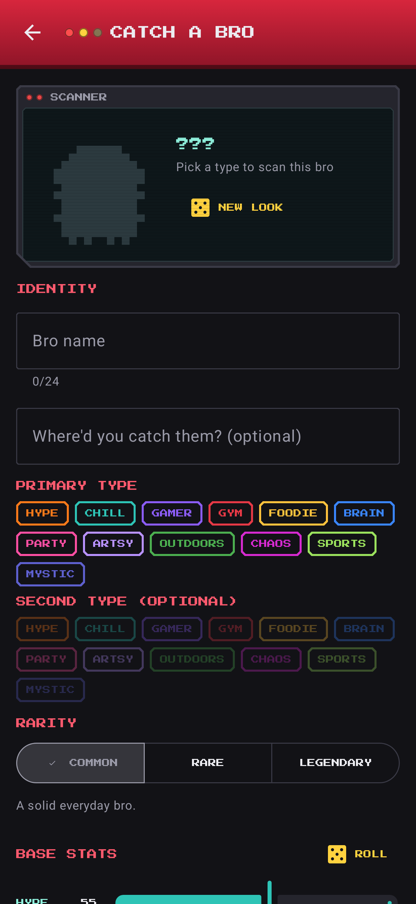
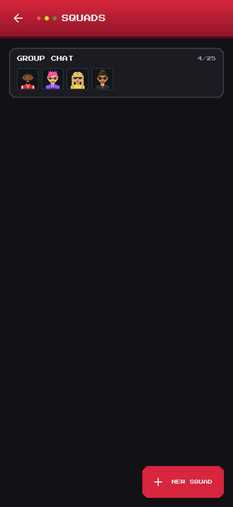

# Brokemon

A Pokédex-style Android app where you "catch" your real-life friends ("bros") and collect them as pixel-art trading cards that evolve as the friendship grows. Local-first: everything stays on the phone.

Package: `com.joecode.brokemon` · Kotlin + Jetpack Compose · MVVM · Room · minSdk 26 · targetSdk 36 · compileSdk 37

| Brodex | Card | Room | Catch | Squads |
|---|---|---|---|---|
|  |  |  |  |  |

## Features

- **Character builder**: bros are people. Build a 32×32 pixel portrait (plus a full-body sprite for their room) from 8 skin tones, 16 hairstyles (fade, waves, afro, braids, locs...), hair color, 6 faces, beards, 6 glasses, 7 hats (incl. bucket hat, backwards cap, hijab), 6 fits (incl. galabeya, leather jacket), fit color and extras (earring, freckles, scar...). Every option tile is a live preview. You can edit the look later from the card's menu.
- **Catch flow**: name, location, primary/secondary type (17 archetypes like Road Rager, Bad Driver, Yapper, Ghost, Main Character, Crypto Bro), manual rarity, funny stats (Rizz, Aura, Yap, Loyal, Chaos, Flake) with re-roll, preset + custom signature moves (max 4). A shiny roll (1 in 10) happens at catch. Catch animation: the Bro Cube drops, shakes three times, clicks, then a star burst and "GOTCHA!".
- **Brodex grid**: collectible cards with type-colored borders, rarity effects (Common: none, Rare: light sweep, Legendary: pulsing glow + gold rim), shiny sparkles, search and type filter.
- **Card detail**: idle-bobbing sprite, bond/evolution panel with score breakdown, animated stat bars, moves, memory log, facts, catch info, "met IRL" date, tradeable/locked toggle, rename / change rarity / release.
- **Memory log**: photo (`TakePicture`), video (`CaptureVideo`), or system photo picker. Files are copied into app-private storage. Thumbnails are EXIF-rotated; videos play in-app.
- **Evolution**: `score = memories×4 + check-ins×3 + facts×2 + min(monthsKnown, 24)`. The stage is always computed, never stored. Evolving also teaches a type-specific bonus move per stage (for example, a Road Rager learns Horn Solo, then Brake Check). When a bro crosses a threshold, the evolution animation plays: aura pulse, rising pixel flames, a white flicker that speeds up, a shift to gold, then a crossfade to the evolved sprite with a shockwave.
- **Squads**: up to 25 bros, a lighthearted type-matchup chart with scouting reasons, and a squad-vs-squad showdown.
- **QR trading**: compact `BRKM1:` payload with short keys. It carries only name, types, stats, moves, rarity, shiny and avatar seed. Photos, videos, facts and dates are never included. Scanning uses the Google Play services code scanner, so the app needs no CAMERA permission.
- **Check on a Bro**: weighted toward whoever you haven't checked on longest, never the same bro twice in a row, with conversation starters taken from their facts and type.
- **Brodex Wrapped**: a New Year event, only shown Dec 20 – Jan 15 (debug builds always show it for testing). A yearly recap pager with caught count, top types, first catch, rarest catches and memory MVP.
- **Hold the card (Pocket-style)**: on a bro's page the card is shown big. Press and drag to tilt it in 3D, with a foil glare that follows your finger (Rare/Legendary/shiny get rainbow foil). It springs back when you let go.
- **Bro rooms**: long-press any card on Home and it grows and zooms into that bro's room (shared-element transition). They stand or sit in a pixel room you decorate: wallpaper, floor, wall decor (game poster, manga shelf, neon sign, Ramadan lantern...), floor items (gaming desk, guitar, mini fridge...), a seat (couch, gaming chair, bean bag, floor cushion) and a rug. Tap them for a quip and their voice line. Hang out once a day, and their photos go up on the memory wall.
- **Search & filter**: the search box matches names. The filter sheet covers type, rarity, bond level, shiny, limited and tradeable, with 6 sort orders. Active filters show as removable chips.
- **Fair bond**: one check-in per bro per day (button, widget, notification and room), and only the first 10 facts count toward evolution.
- **Evolution styles**: power-up aura, lightning storm, glitchy "software update" or spotlight drumroll with confetti, depending on type.
- **Voice notes**: record voice memories (up to 60s) or import voice notes from the phone, plus a 10-second "voice line" per bro, like a signature cry. Tap their portrait to play it. Recorded in-app as .m4a and kept on-device.
- **Seasonal events**: limited frames during Ramadan, Eid (both from the Hijri calendar), New Year, Summer and Exam season, computed offline from the device date. Bros caught during an event keep its frame (lantern, crescent, fireworks, sun, pencil) forever, on the card, story image and QR trades. Debug builds can preview any event from Settings.
- **Backup & restore**: one-tap export of the whole Brodex (photos and videos included) to a .zip you keep anywhere, plus restore. Bros and settings also ride along in Android's end-to-end-encrypted backup and phone-to-phone transfer.
- **Share images**: "Post" renders a 1080×1920 story-sized card (and a Wrapped recap with an identity title like "Shiny Hunter") and opens the Android share sheet.
- **Bro of the Day widget**: a home-screen widget (Jetpack Glance) with today's bro, a nudge, one-tap check-in, and tap to open the card.
- **Reminders**: Birthday facts use a date picker. You get a birthday notification on the day and a Sunday-evening check-in nudge with a "Checked in" button. Everything is scheduled on-device with WorkManager and can be toggled in Settings.
- **Privacy**: onboarding consent, in-app privacy policy, delete-all, no INTERNET permission.

## Build

Open the project in Android Studio (a current stable release that supports AGP 9.4), let Gradle sync, and run the `app` configuration.

```
./gradlew :app:testDebugUnitTest   # 42 unit tests (evolution, QR codec, recommender, matchups, sprites, wrapped)
./gradlew :app:assembleDebug
./gradlew :app:bundleRelease       # Play Store .aab (R8 minified + resource shrinking)
```

Release signing reads `keystore.properties` at the repo root (git-ignored):

```
storeFile=brokemon-release.jks
storePassword=...
keyAlias=brokemon
keyPassword=...
```

## Project map

```
app/src/main/java/com/joecode/brokemon/
  data/model/      Bro, Memory, Fact, BroStats, BroType, Rarity, MediaType, Squad
  data/local/      Room: BroDao, SquadDao, BroDatabase, Gson Converters
  data/            BroRepository, MediaStorage (app-private files), UserPrefs (DataStore)
  domain/          Evolution, EvolutionMoves, TypeMatchups, CheckOnBro, Wrapped, HumanSprite — pure Kotlin, unit tested
  share/           QrCodec (compact payload), QrBitmap (ZXing)
  ui/theme/        Dark-only Pokédex palette, Press Start 2P + sans body text
  ui/components/   DexScaffold (red device header, LEDs), ScreenPanel (LCD), BroCard, BroSprite, effects
  ui/<feature>/    home, catchbro, detail, squads, trade, engage, settings, onboarding, share
  data/backup/     BackupManager (zip export/restore)
  widget/          Bro of the Day Glance widget
  notify/          Reminder worker, notifications, check-in action receiver
```

See `docs/SCHEMA.md` for the database plan, `docs/LEARNING.md` for a guided walkthrough, and `docs/PLAY_STORE.md` for the release checklist.

## Assets and licensing

All character art (drawn pixel by pixel in code), the Bro Cube, the launcher icon and UI art are original or procedurally generated. The pixel font is Press Start 2P (SIL OFL 1.1, see `licenses/`). No Nintendo or Pokémon names, logos or assets are used.
